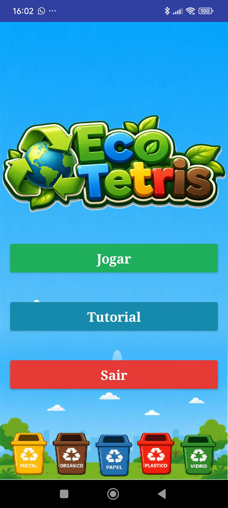
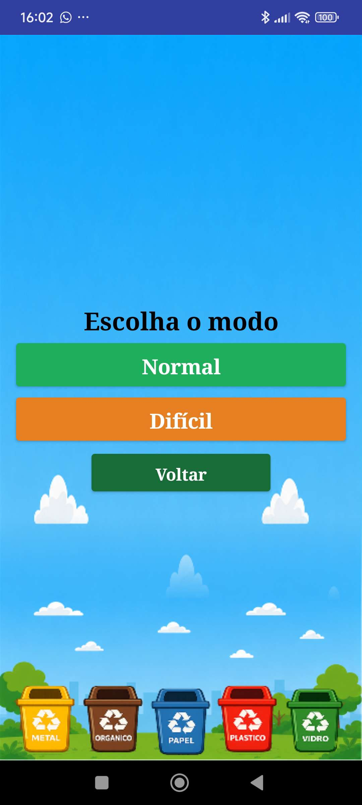
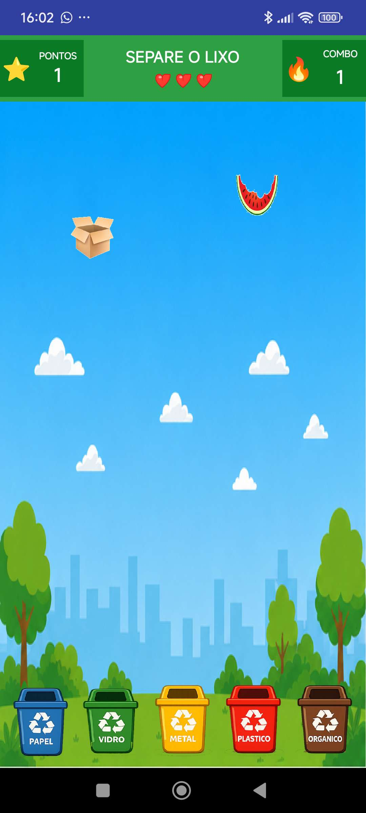
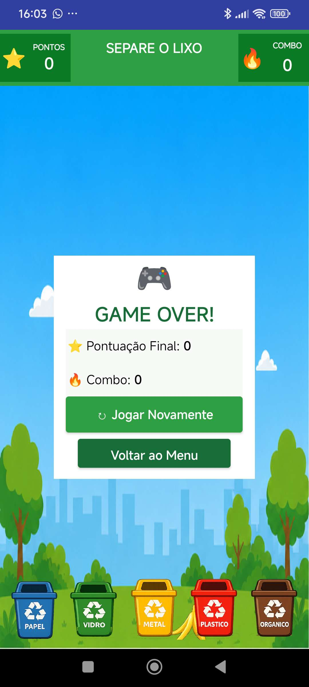
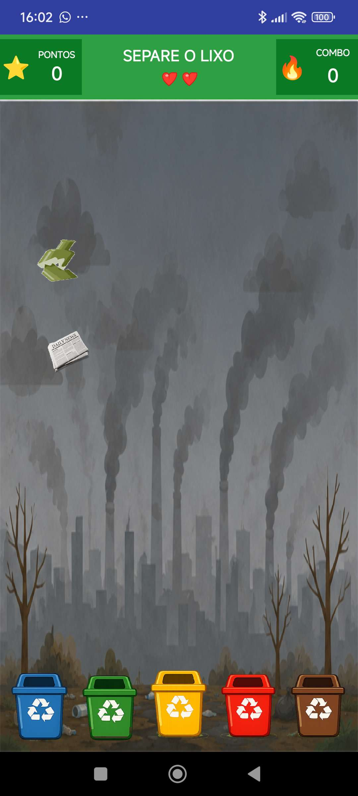

# EcoTetris

EcoTetris e um jogo educativo feito no MIT App Inventor para treinar a separacao correta de residuos reciclaveis. O jogador arrasta cada lixo para a lixeira correspondente, acumula pontos, mantem combos de acertos e tenta sobreviver o maximo possivel sem perder as 3 vidas.

## Sobre o jogo

O objetivo e separar corretamente os lixos nas lixeiras de:

- Papel
- Vidro
- Metal
- Plastico
- Organico

O jogo foi pensado para unir aprendizado ambiental com uma mecanica simples e rapida, parecida com jogos de reflexo: os lixos caem pela tela e o jogador precisa reagir antes que eles cheguem ao chao.

## Funcionalidades

- Tela inicial com menu principal.
- Tela de tutorial explicando as regras.
- Selecao entre modo Normal e modo Dificil.
- Sistema de 3 vidas.
- Pontuacao acumulativa, sem limite por tempo.
- Sistema de combo por acertos seguidos.
- Recorde de maior combo exibido no Game Over.
- Lixos dourados com pontuacao extra.
- Troca aleatoria de posicao entre lixeiras em dificuldades maiores.
- Sons de acerto, erro e Game Over.
- Musica de fundo na tela inicial, no modo Normal e no modo Dificil.

## Modos de jogo

### Modo Normal

Indicado para jogadores iniciantes. O jogo comeca mais lento e fica mais dificil aos poucos conforme a pontuacao aumenta.

No modo Normal:

- O combo fica dourado ao chegar em 15 acertos seguidos.
- O combo fica vermelho claro ao chegar em 25 acertos seguidos.
- A dificuldade aumenta gradualmente.
- As lixeiras podem trocar de lugar depois que o jogador avanca na partida.

### Modo Dificil

Indicado para jogadores que ja conhecem as categorias dos lixos. O jogo comeca mais rapido e sem as descricoes nos lixos.

No modo Dificil:

- A velocidade inicial ja e maior.
- As trocas de posicao das lixeiras acontecem mais cedo.
- O combo fica dourado ao chegar em 10 acertos seguidos.
- O combo fica vermelho claro ao chegar em 20 acertos seguidos.

## Sistema de combo

O combo aumenta quando o jogador acerta lixos em sequencia. Se o jogador errar uma lixeira ou deixar um lixo cair, perde uma vida e o combo volta para 0.

O maior combo da partida fica salvo e aparece na tela de Game Over, para mostrar qual foi a maior sequencia de acertos do jogador.

## Pontuacao

- Lixo normal correto: 1 ponto.
- Lixo dourado correto: 2 pontos.
- Com combo dourado, a pontuacao aumenta.
- Com combo vermelho claro, a pontuacao aumenta ainda mais.

Assim, manter uma sequencia de acertos e a melhor forma de conseguir uma pontuacao alta.

## Como jogar

1. Abra o jogo.
2. Clique em `Jogar`.
3. Escolha `Normal` ou `Dificil`.
4. Arraste cada lixo para a lixeira correta.
5. Evite erros para manter o combo.
6. Tente fazer a maior pontuacao e o maior combo possivel.

## Screenshots

<table>
  <tr>
    <td align="center"><strong>Menu</strong><br></td>
    <td align="center"><strong>Tutorial</strong><br></td>
    <td align="center"><strong>Modos de jogo</strong><br></td>
  </tr>
  <tr>
    <td align="center"><strong>Modo Normal</strong><br></td>
    <td align="center"><strong>Game Over</strong><br></td>
    <td align="center"><strong>Modo Dificil</strong><br></td>
  </tr>
</table>

## Arquivo do projeto

O projeto principal esta na pasta:

```text
app/EcoTetrisJogo.aia
```

Esse arquivo pode ser importado diretamente no MIT App Inventor.

## Como importar no MIT App Inventor

1. Acesse o MIT App Inventor.
2. Clique em `Projects`.
3. Escolha `Import project (.aia) from my computer`.
4. Selecione o arquivo `app/EcoTetrisJogo.aia`.
5. Aguarde o projeto carregar.
6. Use o Companion ou gere o APK para testar no celular.

## Tecnologias usadas

- MIT App Inventor
- Blocos visuais do App Inventor
- Assets PNG para lixos, lixeiras e fundos
- Arquivos MP3/WAV para musicas e efeitos sonoros

## Estrutura do repositorio

```text
EcoTetrisJogo/
├── app/
│   └── EcoTetrisJogo.aia
├── docs/
│   └── screenshots/
├── README.md
└── .gitignore
```

## Status

Projeto em versao jogavel, com modo Normal, modo Dificil, sistema de combo, maior combo, sons, musicas e tela de Game Over.

## Licenca

Este projeto ainda nao possui uma licenca definida.
